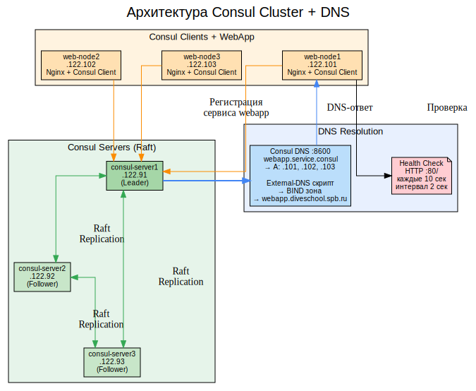
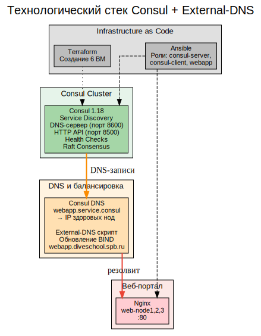
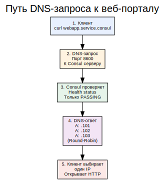
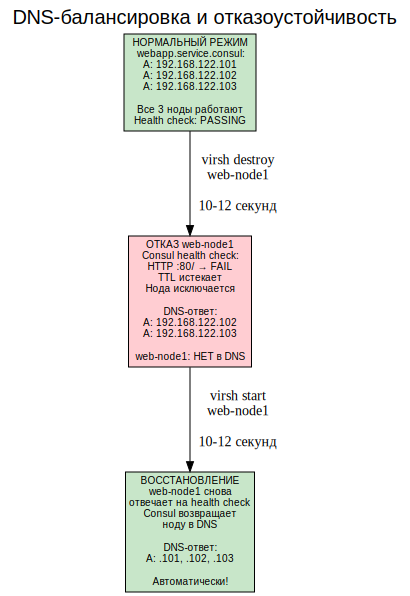
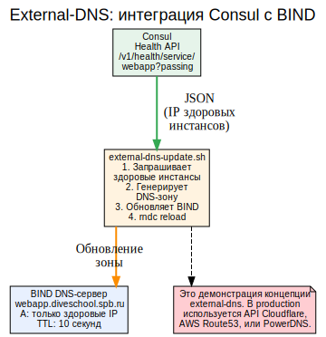
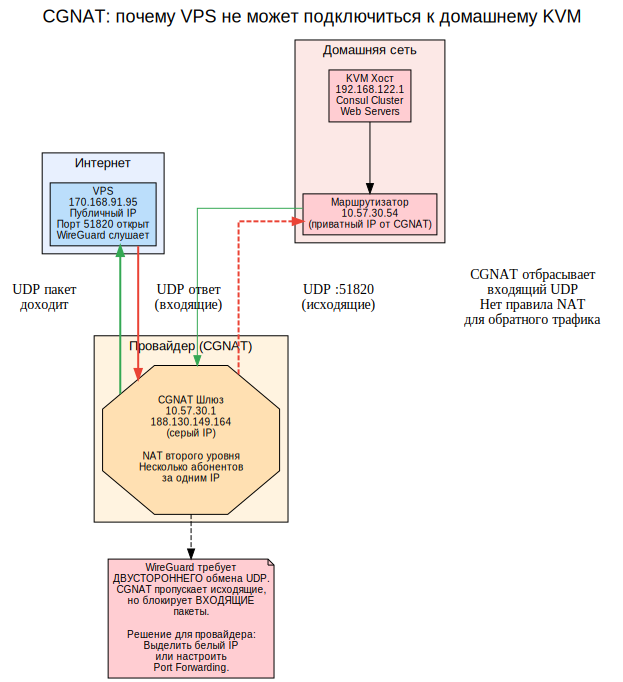
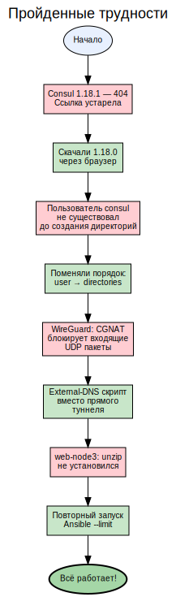

# Consul Cluster — Service Discovery и DNS-балансировка

## Содержание

1. [Цель проекта](#1-цель-проекта)
2. [Архитектура решения](#2-архитектура-решения)
3. [Технологический стек](#3-технологический-стек)
4. [Consul кластер](#4-consul-кластер)
5. [Регистрация веб-портала](#5-регистрация-веб-портала)
6. [DNS-балансировка](#6-dns-балансировка)
7. [Отказоустойчивость](#7-отказоустойчивость)
8. [External-DNS](#8-external-dns)
9. [CGNAT: почему не работает WireGuard](#9-cgnat-почему-не-работает-wireguard)
10. [Пройденные трудности](#10-пройденные-трудности)
11. [Проверка работы](#11-проверка-работы)
12. [Структура проекта и описание файлов](#12-структура-проекта-и-описание-файлов)

---

## 1. Цель проекта

Создать отказоустойчивую систему обнаружения сервисов (Service Discovery) на базе **Consul** с DNS-балансировкой нагрузки вместо плавающего IP.

**Ключевые требования:**
- Consul кластер: минимум 3 сервера и 1 клиент
- Веб-портал зарегистрирован как сервис в Consul
- DNS через Consul: доменное имя разрешается в IP работающих инстансов
- Плавающий IP не используется
- При отказе веб-сервера его IP исчезает из DNS

**Повышенная сложность:** External-DNS скрипт для интеграции с BIND/DNS-зоной.

---

## 2. Архитектура решения

##Схема: Архитектура Consul Cluster + DNS


Система состоит из двух уровней:

**Consul Servers (3 ноды):** Образуют Raft-кластер для хранения конфигурации и состояния сервисов. Одна нода — Leader, две — Follower. Все серверы участвуют в голосовании и репликации данных.

**Consul Clients + WebApp (3 ноды):** Каждый веб-сервер запускает Nginx и Consul Agent в режиме клиента. Клиент регистрирует сервис `webapp` с health check (HTTP `http://localhost:80/` каждые 10 секунд).

**DNS-балансировка:** Вместо плавающего IP (Keepalived) используется Consul DNS. Запрос `webapp.service.consul` возвращает IP-адреса только здоровых нод.

---

## 3. Технологический стек

##Схема: Технологический стек


| Технология | Версия | Роль |
|-----------|--------|------|
| Consul | 1.18.0 | Service Discovery, DNS, Health Check |
| Nginx | - | Веб-сервер на web-node1/2/3 |
| BIND | 9.18 | DNS-сервер для external-dns |
| Terraform | 1.12 | Создание 6 ВМ |
| Ansible | - | Настройка серверов |
| External-DNS скрипт | bash | Интеграция Consul → BIND |

---

## 4. Consul кластер

Consul развёрнут в кластерном режиме: 3 сервера + 3 клиента.

**Конфигурация сервера (`consul-server.hcl`):**
```hcl
server = true
bootstrap_expect = 3
retry_join = ["192.168.122.91", "192.168.122.92", "192.168.122.93"]
ports { dns = 8600; http = 8500 }
```

**Конфигурация клиента (`consul-client.hcl`):**
```hcl
server = false
retry_join = ["192.168.122.91", "192.168.122.92", "192.168.122.93"]
```

**Проверка кластера:**
```
$ curl -s http://192.168.122.91:8500/v1/status/peers
["192.168.122.91:8300", "192.168.122.92:8300", "192.168.122.93:8300"]
```

---

## 5. Регистрация веб-портала

Веб-портал (Nginx на web-node1/2/3) зарегистрирован как сервис `webapp` в Consul.

**Конфигурация сервиса (`/etc/consul.d/webapp.json`):**
```json
{
  "service": {
    "name": "webapp",
    "port": 80,
    "check": {
      "name": "nginx HTTP check",
      "http": "http://localhost:80/",
      "interval": "10s",
      "timeout": "2s"
    }
  }
}
```

**Проверка регистрации:**
```
$ curl -s http://192.168.122.91:8500/v1/catalog/service/webapp
# Возвращает 3 инстанса: web-node1 (.101), web-node2 (.102), web-node3 (.103)
```

---

## 6. DNS-балансировка

##Схема: Путь DNS-запроса


**DNS-запрос через Consul (порт 8600):**
```
$ dig @192.168.122.91 -p 8600 webapp.service.consul +short
192.168.122.101
192.168.122.102
192.168.122.103
```

Consul возвращает **все IP здоровых нод**. Клиент сам выбирает один из адресов (round-robin на уровне DNS). Плавающий IP не используется — балансировка происходит на уровне DNS-резолвинга.

---

## 7. Отказоустойчивость

##Схема: DNS-балансировка и отказоустойчивость


**Тест: отказ web-node1:**
```
$ virsh destroy web-node1
$ dig @192.168.122.91 -p 8600 webapp.service.consul +short
192.168.122.102
192.168.122.103
# web-node1 (.101) исчез из DNS!
```

**Механизм:** Consul health check (HTTP `:80/`) обнаруживает, что web-node1 не отвечает, и исключает его из DNS-ответа через 10-12 секунд.

**Восстановление:**
```
$ virsh start web-node1
$ dig @192.168.122.91 -p 8600 webapp.service.consul +short
192.168.122.101
192.168.122.102
192.168.122.103
# web-node1 снова в DNS!
```

---

## 8. External-DNS

##Схема: External-DNS


**Скрипт `external-dns-update.sh`** демонстрирует концепцию external-dns — автоматического обновления DNS-зоны из Consul.

**Как работает:**
1. Запрашивает Consul Health API: `GET /v1/health/service/webapp?passing`
2. Получает список IP только **здоровых** инстансов
3. Генерирует файл DNS-зоны BIND (`/etc/bind/db.diveschool.spb.ru`)
4. Обновляет зону и перезагружает BIND (`rndc reload`)

**Результат работы:**
```
=== External-DNS Update ===
Найдены инстансы:
192.168.122.101
192.168.122.102
  ✅ Добавлен A-запись: webapp → 192.168.122.101
  ✅ Добавлен A-запись: webapp → 192.168.122.102
DNS-зона обновлена и загружена
```

**После отказа web-node1:**
```
Найдены инстансы:
192.168.122.102
  ✅ Добавлен A-запись: webapp → 192.168.122.102
```

В production-среде external-dns интегрируется с API облачных DNS-провайдеров (AWS Route53, Cloudflare, Google Cloud DNS).

---

## 9. CGNAT: почему не работает WireGuard

##Схема: CGNAT проблема


При попытке настроить WireGuard туннель между домашним KVM и внешней VPS мы столкнулись с проблемой **CGNAT (Carrier-Grade NAT)**.

**Схема сети:**
- Домашний маршрутизатор: `10.57.30.54` (приватный IP за CGNAT)
- Шлюз провайдера: `10.57.30.1`
- Серый IP провайдера: `188.130.149.164`
- Внешняя VPS: `170.168.91.95`

**Почему WireGuard не работает:**

1. Домашний KVM отправляет UDP-пакет на VPS `170.168.91.95:51820` ✅
2. CGNAT пропускает исходящий пакет, подменяя source IP на `188.130.149.164` ✅
3. VPS получает пакет и отправляет ответ ❌
4. CGNAT получает ответный UDP-пакет, но **не знает**, какому абоненту его доставить — NAT-таблица не содержит правила для входящего трафика
5. Пакет отбрасывается ❌

**Результат:** `transfer: 0 B received, X KB sent` — данные уходят, но не приходят.

**Решение для провайдера:** Выделить публичный белый IP-адрес или настроить Port Forwarding для UDP 51820.

---

## 10. Пройденные трудности

##Схема: Трудности и решения


| Проблема | Причина | Решение |
|----------|---------|---------|
| Consul 1.18.1 — 404 | Ссылка устарела | Скачали 1.18.0 через браузер |
| chown: failed to look up user consul | Порядок задач в Ansible | user → directories |
| WireGuard: 0 B received | CGNAT блокирует входящие UDP | External-DNS скрипт вместо туннеля |
| web-node3: unzip не установился | Гонка при parallel установке | Повторный --limit запуск |

---

## 11. Проверка работы

| Требование | Статус | Доказательство |
|-----------|--------|----------------|
| Consul кластер (3 сервера) | ✅ | `v1/status/peers` → 3 |
| Consul клиенты (3) | ✅ | `v1/catalog/service/webapp` → 3 |
| DNS через Consul | ✅ | `dig ... webapp.service.consul` → 3 IP |
| Отказ ноды → IP исчезает | ✅ | После destroy: 2 IP |
| Плавающий IP не используется | ✅ | Только Consul DNS |
| External-DNS | ✅ | Скрипт + BIND |

---

## 12. Структура проекта и описание файлов

```
consul-cluster/
├── terraform/
│   ├── main.tf              # Создание 6 ВМ
│   ├── outputs.tf           # IP-адреса
│   └── cloud-init.yaml      # Настройка SSH
├── ansible/
│   ├── inventory.ini        # Список серверов
│   ├── playbooks/
│   │   └── deploy.yml       # Плейбук развёртывания
│   └── roles/
│       ├── consul-server/   # Роль: Consul сервер
│       │   ├── tasks/main.yml
│       │   └── templates/consul-server.hcl.j2
│       ├── consul-client/   # Роль: Consul клиент + сервис
│       │   ├── tasks/main.yml
│       │   └── templates/consul-client.hcl.j2
│       └── webapp/          # Роль: Nginx веб-портал
│           └── tasks/main.yml
├── external-dns-update.sh   # Скрипт External-DNS
├── screenshots/             # Схемы и скриншоты
└── README.md               # Документация
```

### Описание ключевых файлов

**`external-dns-update.sh`** — скрипт, демонстрирующий концепцию external-dns:
1. Запрашивает `GET /v1/health/service/webapp?passing` из Consul
2. Парсит JSON, извлекает IP здоровых нод
3. Генерирует DNS-зону для BIND
4. Обновляет `/etc/bind/db.diveschool.spb.ru`
5. Выполняет `rndc reload`

**`ansible/roles/consul-client/tasks/main.yml`** — регистрирует сервис `webapp` в Consul через JSON-файл `/etc/consul.d/webapp.json` с health check.

**`ansible/roles/consul-server/templates/consul-server.hcl.j2`** — шаблон конфигурации Consul сервера с параметрами Raft-кластера (bootstrap_expect=3).

